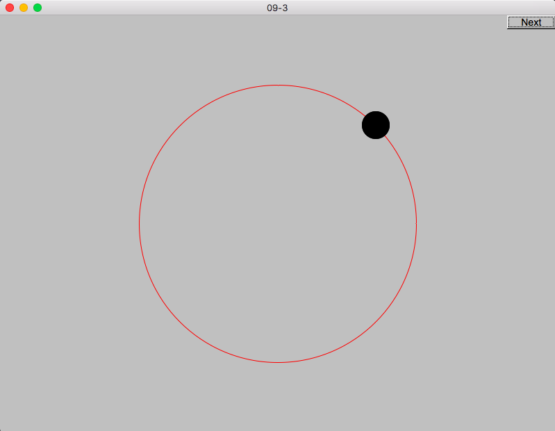

# 第九次上机作业

## 第一题

### 题目

定义由4条线和4个圆弧组成的Box类，绘制一个圆角矩形（提示：部分矩形可以使用Arc类绘制，需要更新GUI库。感兴趣的同学也可以自行实现Arc类）

## 第二题

### 题目

编写程序绘制如下图所示的类结构图。

### 效果

## 第三题

### 题目

绘制一个圆，然后延圆周移动一个标记(每按一次”Next"按钮，标记移动一段距离) 

### 效果

