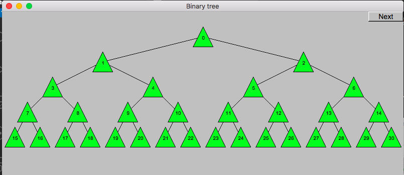

# 第十次上机作业

## 第一题

### 题目

定义Striped_rectangle类，不采用标准的填充方式，而是用一个像素宽的水平线“填充”该举行内部（比如每隔一个像素画一条线）。你可能需要通过设置先线宽和线间距来获得喜欢的图案。

### 效果

## 第二题

定义一个Binary_Tree类。层数作为一个参数（levels == 0 表示没有节点，levels == 1 表示有一个节点，levels == 2 表示有一个顶层节点和两个子节点，levels == 3 表示有一个顶层节点、两个子节点以及这两个子节点的各自两个子节点，依此类推）。使用小圆圈表示一个节点，并用线连接这些节点。注：在计算机科学中，树是从顶层节点（通常称为根）向下生长。

## 第三题

修改Binary_Tree类，使用虚函数来绘制它的节点。然后，从Binary_Tree派生一个新类，对节点使用一个不同的表示（比如一个三角形）来覆盖此虚函数。

## 第四题

修改Binary_Tree类，使其接受一个参数（或者多个）来指出用什么类型的线来连接这些节点（例如不同的颜色/粗细/虚实）。注意，本题和前一题是如何使用两种不同的方式使得类的层次结构更加灵活和有用的。

## 第五题

为Binary_Tree类增加一个操作，将文本添加到节点上。你可能必须修改Binary_Tree的设计来实现这个功能。选择一种方式来标识节点，比如，你可以用字符串“lrrlr"表示向下遍历二叉树左、右、右、左和右会到达当前节点（以l或者r开头都可以与根节点匹配）

## 二叉树效果

