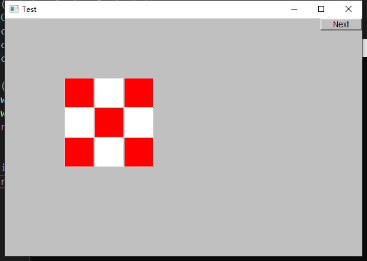
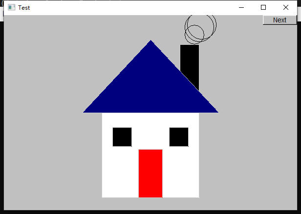
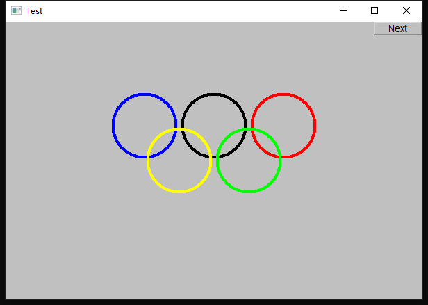

# 上机作业8
## 第一题
### 题目描述
绘制一个3*3的红白交替的井字棋棋盘
### 作业代码
[problem1.cpp](problem1.cpp)
### 运行效果

## 第二题
### 题目描述
绘制一个二维的房屋正视图，包括一个门、两个窗户、带烟囱的屋顶，可以随意添加其他的细节，比如从烟囱“冒烟”等
### 作业代码
[problem2.cpp](problem2.cpp)
### 运行效果

## 第三题
### 题目描述
绘制奥林匹克五环图（注：对圆环重叠部分的颜色不做要求）
### 作业代码
[problem3.cpp](problem3.cpp)
### 运行效果

